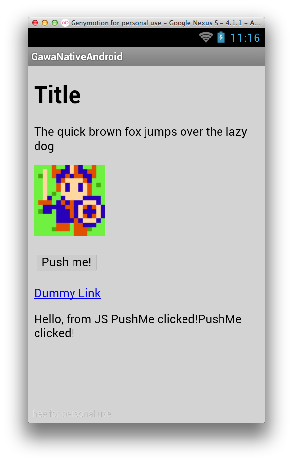

Androidでガワネイティブ
=====================

ネイティブアプリなんだけどネイティブのコードは極力書かず、
WebViewを使ってhtml+JavaScriptを使ってアプリを組みたい。
今回はAndroid, Javaで作ってみる。

[コード](https://github.com/tyfkda/GawaNativeAndroid)

## WebViewを全画面の大きさで配置する
レイアウトのxmlで指定する

```xml
<RelativeLayout xmlns:android="http://schemas.android.com/apk/res/android"
    xmlns:tools="http://schemas.android.com/tools"
    android:layout_width="match_parent"
    android:layout_height="match_parent"
    tools:context="com.tyfkda.gawanativeandroid.MainActivity" >

    <WebView
        android:id="@+id/webView"
        android:layout_width="match_parent"
        android:layout_height="match_parent" />

</RelativeLayout>
```

* `layout_width`、`layout_height`ともに`match_parent`を指定することで全画面にする

## htmlの表示

配置したWebViewを使ってJavaからブラウザを操作する。

```java
// MainActivity.java
public class MainActivity extends Activity {
  @Override
  protected void onCreate(Bundle savedInstanceState) {
    super.onCreate(savedInstanceState);
    setContentView(R.layout.activity_main);

    WebView webView = (WebView) findViewById(R.id.webView);
    webView.loadUrl("http://www.example.com/");
  }
}
```

* `findViewById`でWebViewを取得して、[`WebView#loadUrl`](http://developer.android.com/intl/ja/reference/android/webkit/WebView.html#loadUrl(java.lang.String%29)
  でページの読み込みを指定できる
* インターネットからウェブページを読み込むためにはAndroidManifest.xmlで`<uses-permission android:name="android.permission.INTERNET"/>`
  を指定して、アプリでのインターネット利用を有効にする必要がある

## アセット内のhtmlの表示
外部のurlではなく、アセットに含めたhtmlファイルを読み込むにはURLに`file:///android_asset/〜`
と指定する

```java
// Java
    webView.loadUrl("file:///android_asset/index.html");
```

## アセット内のhtmlから画像、JavaScript、CSSを読み込む
html内で相対パスで書けばアセット内のファイルが自動的に読み込まれる

```html
<link rel="stylesheet" type="text/css" href="main.css" />

<script type="text/javascript" src="main.js"></script>
```

## JavaScriptとネイティブの連携
### JavaScriptからネイティブ(Java)を呼び出す
JavaScriptからネイティブに対してなにか起動するにはWebViewにインタフェース用のオブジェクトを
登録してやる

```java
// Java
    webView.addJavascriptInterface(new JavaScriptInterface(this, webView), "Native");
```

```java
// JavaScriptInterface.java
public class JavaScriptInterface {
  private Context context;
  private WebView webView;

  public JavaScriptInterface(Context context, WebView webView) {
    this.context = context;
    this.webView = webView;
  }

  public void showToast(String string) {
    Toast.makeText(context, string, Toast.LENGTH_SHORT).show();
  }
}
```

```js
// JavaScript
Native.showToast('PushMe clicked!');
```

* [`WebView#addJavascriptInterface`](http://developer.android.com/intl/ja/reference/android/webkit/WebView.html#addJavascriptInterface(java.lang.Object, java.lang.String%29)
  でインタフェースの登録
* 登録したインタフェースのpublicメソッドをJavaScriptから呼び出せる
  * 型を自動的に変換してくれる、便利

### ネイティブ(Java)からJavaScriptを呼び出す
[`WebView#loadUrl`](http://developer.android.com/intl/ja/reference/android/webkit/WebView.html#loadUrl(java.lang.String%29)を使用する：

```java
// Java
    webView.loadUrl("javascript:" + script);
```

* JavaScriptのコードを表す文字列の前に`"javascript:"`を追加してやることでJavaScriptコード
  として解釈される
* API level 19以降には[`WebView#evaluateJavascript`](http://developer.android.com/intl/ja/reference/android/webkit/WebView.html#evaluateJavascript(java.lang.String, android.webkit.ValueCallback<java.lang.String>%29)
  というメソッドが追加されているらしい

## URLリクエストを横取りする
Javaで登録したインタフェースのメソッドをJavaScriptから呼び出せるので、使うかどうかわからないけど、
URLリクエストも横取りできる。

```java
// Java
    webView.setWebViewClient(new WebViewClient() {
      @Override
      public boolean shouldOverrideUrlLoading(WebView view, String url) {
        ...
      }
    });
```

* WebViewに対して [`setWebViewClient`](http://developer.android.com/intl/ja/reference/android/webkit/WebView.html#setWebViewClient(android.webkit.WebViewClient%29)
  で[`WebViewClient`](http://developer.android.com/intl/ja/reference/android/webkit/WebViewClient.html)
  を登録できて、その[`shouldOverrideUrlLoading`](http://developer.android.com/intl/ja/reference/android/webkit/WebViewClient.html#shouldOverrideUrlLoading(android.webkit.WebView, java.lang.String%29)
  でURLに対する処理を扱える
  * 横取りしてなにか処理した時には`true`を返す、そうでなくて通常の読み込みを継続する場合には
    `false`を返す


## 実行例

